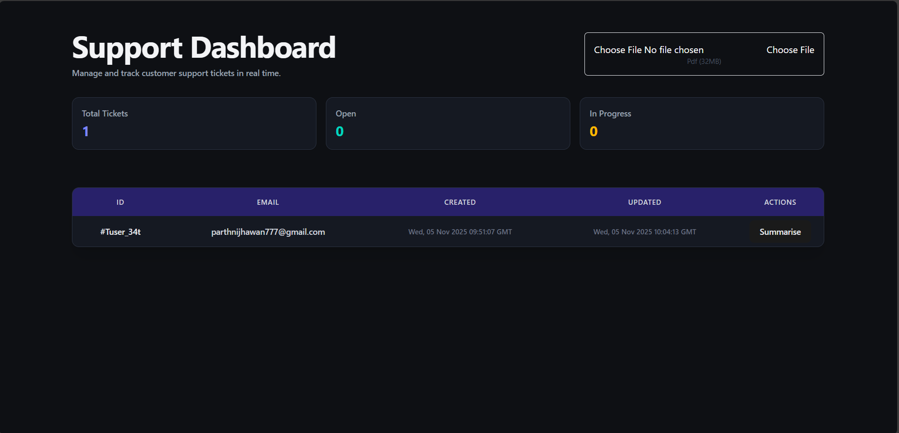
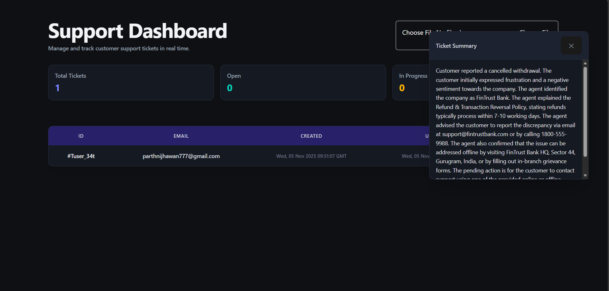
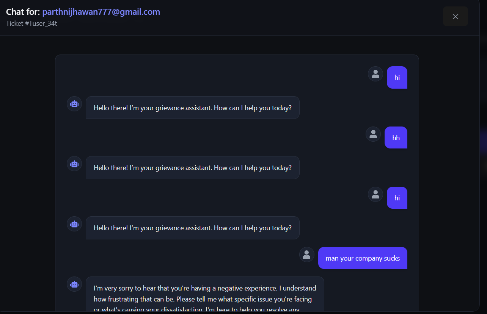
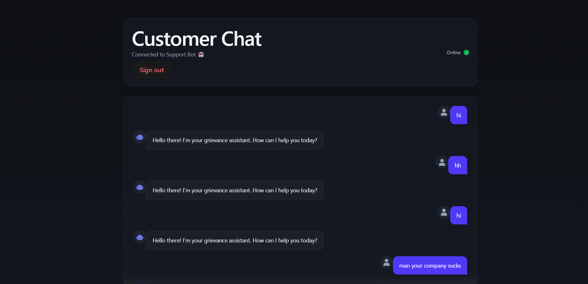

# 💬 AI-Powered Customer Support Dashboard


---

## 🚀 Overview

The **AI-Powered Customer Support Dashboard** is a full-stack real-time support system that connects customers with an **AI-based chatbot** and enables admins to monitor, summarize, and manage tickets in real time.  

Built with **React, Flask, Node.js/Express, MongoDB, LangChain, and Socket.IO**, it allows:
- Users to chat with an AI assistant.
- Real-time ticket creation and updates.
- Admins to view live conversations and generate AI summaries.

---

## ⚙️ Tech Stack

| Layer | Technology | Purpose |
|-------|-------------|----------|
| 🖥️ Frontend | **React + Tailwind CSS** | Interactive UI and real-time dashboard |
| 🔧 Backend (Core) | **Flask** | Handles AI chatbot logic and Socket.IO events |
| 🌐 File Upload API | **Node.js + Express** | File upload backend for UploadThing |
| ⚡ Realtime Layer | **Socket.IO** | Live updates for tickets and messages |
| 🧠 AI Layer | **LangChain + Google Generative AI** | RAG-powered responses and chat summarization |
| 🗄️ Database | **MongoDB (Mongoose)** | Stores users, tickets, and message history |
| 🔐 Authentication | **Clerk** | Secure user/admin login system |
| 📁 File Handling | **UploadThing** | For uploading logs, CSVs, or context files |

---

## ✨ Key Features

### 💡 AI Chat System
- RAG-based chatbot that replies using your company’s policies or uploaded files.
- Every conversation auto-creates a **support ticket**.
- Persistent conversation history in MongoDB.

### 📊 Admin Dashboard
- Real-time updates when new tickets/messages arrive.
- Click any ticket to open the chat popover.
- AI summarization for quick overviews.
- File uploads for logs or reference documents.

### 🔁 Realtime Updates
- Powered by **Socket.IO** for instant sync.
- Dashboard updates automatically — no refresh needed.
- Admin chat view stays live as users interact.

### 🧾 AI Summarization
- Flask backend integrates **LangChain**.
- One-click summarization of entire conversations.

---

## 🧠 How It Works

1. User sends a message via chatbot UI.  
2. Flask processes message → generates AI response (LangChain).  
3. Message and ticket are saved in MongoDB.  
4. Flask emits a **Socket.IO event**.  
5. React dashboard instantly receives and displays the update.  
6. Admin can open any chat and view it live.  
7. “Summarize” button triggers Flask → LangChain → returns a condensed summary.  
8. UploadThing handles CSV/log uploads for context.

---

## 🖼️ Project UI Preview

### 🧭 Dashboard Overview  
<p align="center">
  
  
</p>

### 💬 Chat interface from dashboard 
<p align="center">
  
 
</p>

##   💬 Chat interface from user side
<p align="center">
  
</p>


---

## ⚡ Installation & Setup

### 1️⃣ Clone the Repository
```bash
git clone https://github.com/your-username/ai-support-dashboard.git
cd ai-support-dashboard
